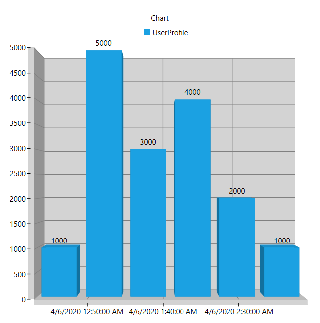

# Getting Started with WPF 3D Chart (SfChart3D)

This is demo application of [WPF SfChart3D](https://help.syncfusion.com/wpf/sfchart3d/gettingstarted) control. The minimal set of required properties have been configured in this project to get started with SfChart3D in WPF.

## Initialize chart

Import the SfChart namespace in your XAML page.

###### Xaml
```xaml
 xmlns:chart="clr-namespace:Syncfusion.UI.Xaml.Charts;assembly=Syncfusion.SfChart.WPF"
```
###### C#
```c#
using Syncfusion.UI.Xaml.Charts;
```

Then initialize an empty chart with PrimaryAxis and SecondaryAxis as shown below,

###### Xaml
```xaml
    <chart:SfChart3D >
            
        <!--PrimaryAxis-->
        <chart:SfChart3D.PrimaryAxis>
            <chart:DateTimeAxis3D/>
        </chart:SfChart3D.PrimaryAxis>
        <!--SecondaryAxis-->
        <chart:SfChart3D.SecondaryAxis>
            <chart:NumericalAxis3D/>
        </chart:SfChart3D.SecondaryAxis>

    </chart:SfChart3D>

```

###### C#
```C#

     SfChart3D Chart3D = new SfChart3D()
        {
            PrimaryAxis = new DateTimeAxis3D(),

            SecondaryAxis = new NumericalAxis3D(),
        };
```

## Initialize view model

Since, the above step will produce only an empty column 3D chart, plotting data must be added to the chart. This step illustrates how to create a sample data source. The data source must implement the IEnumerable interface.

###### C#
```C#
    public class UserProfile
    {
        public DateTime TimeStamp { get; set; }
        public double NoOfUsers { get; set; }
    }

```

Next, create a view model class and initialize a list of `UserProfile` objects as follows.

###### C#
```C#

    public class UsersViewModel
    {
        public UsersViewModel()
        {
            this.UsersList = new ObservableCollection<UserProfile>();

            DateTime date = DateTime.Today;

            UsersList.Add(new UserProfile { TimeStamp = date.AddHours(0.5), NoOfUsers = 1000 });
            UsersList.Add(new UserProfile { TimeStamp = date.AddHours(1), NoOfUsers = 5000 });
            UsersList.Add(new UserProfile { TimeStamp = date.AddHours(1.5), NoOfUsers = 3000 });
            UsersList.Add(new UserProfile { TimeStamp = date.AddHours(2), NoOfUsers = 4000 });
            UsersList.Add(new UserProfile { TimeStamp = date.AddHours(2.5), NoOfUsers = 2000 });
            UsersList.Add(new UserProfile { TimeStamp = date.AddHours(3), NoOfUsers = 1000 });
        }
        public ObservableCollection<UserProfile> UsersList { get; set; }

    }

```

Set the ViewModel instance as the DataContext of your window; this is done to bind properties of ViewModel. Include namespace of `ViewModel` class to your XAML window if you prefer to set `DataContext` in XAML.

###### Xaml
```xaml
<Window x:Class="GettingStarted_3DCharts.MainWindow"
        xmlns="http://schemas.microsoft.com/winfx/2006/xaml/presentation"
        xmlns:x="http://schemas.microsoft.com/winfx/2006/xaml"
        xmlns:d="http://schemas.microsoft.com/expression/blend/2008"
        xmlns:mc="http://schemas.openxmlformats.org/markup-compatibility/2006"
        xmlns:local="clr-namespace:GettingStarted_3DCharts "
        xmlns:chart ="clr-namespace:Syncfusion.UI.Xaml.Charts;assembly=Syncfusion.SfChart.WPF"
        mc:Ignorable="d"
        Title="MainWindow" Height="350" Width="525">

    <Window.DataContext>
        <local:UsersViewModel/>
    </Window.DataContext>

</Window>

```
###### C#
```C#
this.DataContext = new UsersViewModel();
```

## Populate chart with data

As we are going to visualize the comparison of heights in the data model, add [`ColumnSeries3D`](https://help.syncfusion.com/cr/cref_files/wpf/Syncfusion.SfChart.WPF~Syncfusion.UI.Xaml.Charts.ColumnSeries3D.html)  to [`SfChart3D.Series`]( https://help.syncfusion.com/cr/cref_files/wpf/Syncfusion.SfChart.WPF~Syncfusion.UI.Xaml.Charts.SfChart3D~Series.html) property, and then bind the Data property of the above ViewModel to the [`ColumnSeries3D.ItemsSource`](https://help.syncfusion.com/cr/cref_files/wpf/Syncfusion.SfChart.WPF~Syncfusion.UI.Xaml.Charts.ChartSeriesBase~ItemsSource.html) property as follows.

Need to set [`XBindingPath`](https://help.syncfusion.com/cr/cref_files/wpf/Syncfusion.SfChart.WPF~Syncfusion.UI.Xaml.Charts.ChartSeriesBase~XBindingPath.html) and [`YBindingPath`](https://help.syncfusion.com/cr/cref_files/wpf/Syncfusion.SfChart.WPF~Syncfusion.UI.Xaml.Charts.XyDataSeries3D~YBindingPath.html) properties, so that [`SfChart3D`](https://help.syncfusion.com/cr/cref_files/wpf/Syncfusion.SfChart.WPF~Syncfusion.UI.Xaml.Charts.SfChart3D.html) would fetch values from the respective properties in the data model to plot the series.

###### Xaml
```xaml

    <Window.DataContext>
        <local:UsersViewModel/>
    </Window.DataContext>
    

  <chart:SfChart3D x:Name="Chart3D" Width="500" Height="500">
            
        <!--PrimaryAxis-->
        <chart:SfChart3D.PrimaryAxis>
            <chart:DateTimeAxis3D/>
        </chart:SfChart3D.PrimaryAxis>
        
        <!--SecondaryAxis-->
        <chart:SfChart3D.SecondaryAxis>
            <chart:NumericalAxis3D/>
        </chart:SfChart3D.SecondaryAxis>

        <chart:ColumnSeries3D ItemsSource="{Binding UsersList}" XBindingPath="TimeStamp"
            YBindingPath="NoOfUsers"></chart:ColumnSeries3D>
            
    </chart:SfChart3D>

```
###### C#
```C#

    this.DataContext = new UsersViewModel();
 
    SfChart3D chart3D = new SfChart3D();

    //Initializing primary axis

     CategoryAxis3D primaryAxis = new CategoryAxis3D();
     primaryAxis.Header = "Time";
     primaryAxis.FontSize = 14;
     chart.PrimaryAxis = primaryAxis;

     //Initializing secondary Axis
     NumericalAxis3D secondaryAxis = new NumericalAxis3D();
     secondaryAxis.Header = "Users";
     secondaryAxis.FontSize = 14;
     chart.SecondaryAxis = secondaryAxis;

    //Initializing column series
    ColumnSeries3D series = new ColumnSeries3D()
        {
            ItemsSource = new UsersViewModel().UsersList,
            XBindingPath = "TimeStamp",
            YBindingPath = "NoOfUsers"
        };

    Chart3D.Series.Add(series);
    this.Content = chart3D;

```

## <a name="output"></a>Output ##




